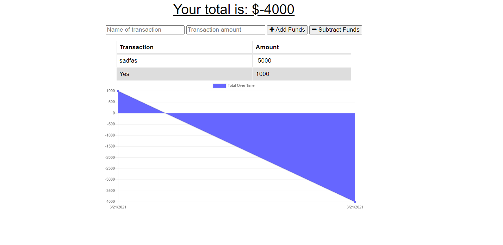

# PWABudgetTracker

# Purpose

The Budget tracker allows a use to track expenses and saves and updates the information when offline.
As long as the user is online when the app opens, they can enter inforamtion when offline.

# Usage

Open the app <a href="https://tranquil-beyond-60073.herokuapp.com/">here</a>.

